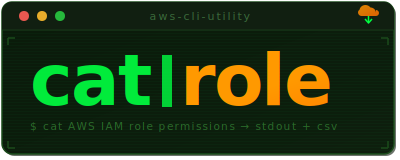

# catrole



> catrole is a python pip package which let's you:

AWS IAM Role/Policy permission viewer — see what a role or policy can do.

#### Architectural Diagram


## Requirements

- Python >= 3.11
- AWS credentials configured (via `~/.aws/credentials`, environment variables, or SSO)
- A cross-account IAM role you can assume in target account(s)

## Installation

### From source (local)

```bash
git clone https://github.com/RajChowdhury240/catrole.git
cd cat-role
pip3 install .
```

For development (editable install):

```bash
pip3 install -e .
```

### From PyPI (remote)

```bash
pip3 install catrole
```

## Usage

`catrole` uses `-R` to specify an IAM role to assume in the target account.

If `-R` is not provided, `catrole` reads the role name from `~/.catrole`.

### Setting a default assume role

```bash
echo "readonly-role" > ~/.catrole
```

Once set, you can omit `-R` from all commands:

*where -a is account and -r is target role you're scanning for*

```bash
catrole -a 123456789012 -r MyAppRole
```

`-R` on the command line always takes precedence over `~/.catrole`.

### Scan a role

*-R is the assume role you're using to switch to another account , -a is account and -r is target role you're scanning for*

```bash
catrole -R readonly-role -a 123456789012 -r AppRole
```

### Scan a policy

```bash
catrole -R readonly-role -a 123456789012 -p Policy
```

### Scan by ARN
* -A is ARN Mode*
```bash
catrole -R readonly-role -A arn:aws:iam::123456789012:role/AppRole
```

### Search across all org accounts
* -s is search mode*
```bash
catrole -R readonly-role -s '*lambda*'
```

### Search within a single account

```bash
catrole -R readonly-role -s '*admin*' -a 123456789012
```

### Find roles by IAM action

Search across all org accounts for roles that can perform a specific action:
* -f is action search mode*

```bash
catrole -R readonly-role -f 's3:CreateBucket'
```

Use wildcards to find broader action patterns:

```bash
catrole -R readonly-role -f 's3:*' -a 123456789012
catrole -R readonly-role -f '*lambda*'
```

Results are printed as a table and automatically saved to a CSV file.

Run `catrole -h` for full help.
