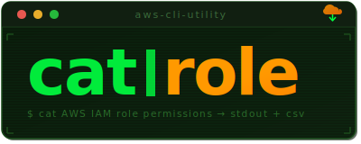

# catrole



AWS IAM visibility tool — inspect roles, policies, users, groups, and AWS Identity Center permission sets across your organization.

#### Architectural Diagram


## Requirements

- Python >= 3.11
- AWS credentials configured (via `~/.aws/credentials`, environment variables, or SSO)
- A cross-account IAM role you can assume in target account(s)

## Installation

### From PyPI

```bash
pip3 install catrole
```

### From source

```bash
git clone https://github.com/RajChowdhury240/catrole.git
cd catrole
pip3 install .
```

For development (editable install):

```bash
pip3 install -e .
```

---

## How it works

`catrole` uses `-R` to specify an IAM role to assume in the target account via STS. All API calls are made using the temporary credentials from that assumed role.

If `-R` is not provided, `catrole` reads the role name from `~/.catrole`.

### Setting a default assume role

```bash
echo "readonly-role" > ~/.catrole
```

Once set, you can omit `-R` from all commands. `-R` on the command line always takes precedence over `~/.catrole`.

---

## Modes

### 1. Scan a role

Shows all attached (managed + inline) policies for an IAM role, flattened into individual permission rows.

```bash
catrole -R readonly-role -a 123456789012 -r AppRole
```

### 2. Scan a policy

Shows all statements in a customer-managed or AWS-managed policy.

```bash
catrole -R readonly-role -a 123456789012 -p MyPolicy
```

### 3. Scan by ARN

Directly specify the full ARN of a role or policy — account ID is extracted automatically.

```bash
catrole -R readonly-role -A arn:aws:iam::123456789012:role/AppRole
catrole -R readonly-role -A arn:aws:iam::123456789012:policy/MyPolicy
```

### 4. Search roles/policies by name pattern

Wildcard search for roles and policies by name. Searches all active accounts in the AWS Organization by default, or scope it to a single account with `-a`.

```bash
# Org-wide
catrole -R readonly-role -s '*lambda*'

# Single account
catrole -R readonly-role -s '*admin*' -a 123456789012
```

Wildcards: `*` matches any sequence of characters, `?` matches a single character.

### 5. Find roles by IAM action

Search for roles whose policies grant a specific IAM action. Supports wildcards. Searches all org accounts or a single account.

```bash
# Find all roles that can create S3 buckets
catrole -R readonly-role -f 's3:CreateBucket'

# Find all roles with any S3 permission
catrole -R readonly-role -f 's3:*'

# Scope to a single account
catrole -R readonly-role -f 's3:*' -a 123456789012
```

Matching is bidirectional: a policy with `s3:*` matches a search for `s3:CreateBucket`, and a search for `s3:*` matches a policy with a specific action like `s3:PutObject`.

### 6. Scan an IAM user

Shows a complete profile for an IAM user including:

- User metadata (ARN, User ID, path, creation date, password last used)
- Access keys — Key ID, status (Active/Inactive), creation date, last used date, region, and service
- MFA devices — serial number and enabled date (warns if no MFA is configured)
- Group memberships
- Direct permissions — all attached managed and inline policies directly on the user
- Group-inherited permissions — policies from every group the user belongs to, shown per group

```bash
catrole -R readonly-role -a 123456789012 -u john.doe
```

The CSV export includes a `Source` column indicating whether each permission row comes from `Direct` attachment or a specific `Group:<name>`.

### 7. Scan an IAM group

Shows a complete profile for an IAM group including:

- Group metadata (ARN, Group ID, path, creation date)
- All members (user name, ARN, creation date)
- All permissions — attached managed and inline policies, flattened into individual rows

```bash
catrole -R readonly-role -a 123456789012 -g MyDevGroup
```

### 8. Scan an AWS Identity Center permission set

Shows a complete profile for an IDC permission set including:

- Permission set metadata (ARN, instance ARN, identity store ID, description, session duration, relay state)
- AWS managed policies attached to the permission set
- Customer managed policy references
- Inline policy (pretty-printed JSON)
- All provisioned accounts and principal assignments — every user and group assigned to the permission set across all provisioned accounts, with names resolved via the Identity Store

```bash
catrole -R readonly-role -a 123456789012 -P MyPermissionSet --region us-east-1
```

> **`--region` is required** when your Identity Center instance is not in your shell's default AWS region. The `sso-admin` and `identitystore` APIs are regional and must target the region where IDC was set up (commonly `us-east-1`).

---

## Output

Every scan prints a colour-coded Rich table to the terminal and automatically saves results to a timestamped CSV file in the current directory.

| Mode | CSV filename pattern |
|------|----------------------|
| Role | `iam-role_<account>_<name>_<ts>.csv` |
| Policy | `iam-policy_<account>_<name>_<ts>.csv` |
| Search | `iam-search_<pattern>_<ts>.csv` |
| Action search | `iam-action-search_<pattern>_<ts>.csv` |
| User | `iam-user_<account>_<name>_<ts>.csv` |
| Group | `iam-group_<account>_<name>_<ts>.csv` |
| Permission Set | `idc-permset_<account>_<name>_<ts>.csv` |

---

## All flags

```
  -R, --assume-role ROLE      IAM role to assume in target account(s) (or set via ~/.catrole)
  -a, --account ACCOUNT       AWS account ID (12 digits)
  -r, --role ROLE             IAM role name to scan
  -p, --policy POLICY         IAM policy name to scan
  -A, --arn ARN               Full ARN of an IAM role or policy
  -s, --search PATTERN        Wildcard pattern to search role/policy names across org
  -f, --find-action ACTION    IAM action pattern to find in role policies across org
  -u, --user USER             IAM user name to scan
  -g, --group GROUP           IAM group name to scan
  -P, --permission-set NAME   IDC permission set name to scan
      --region REGION         AWS region for IDC (required with -P if not your default region)
  -v, --version               Show version and exit
  -h, --help                  Show help and exit
```

Run `catrole -h` for full help.
